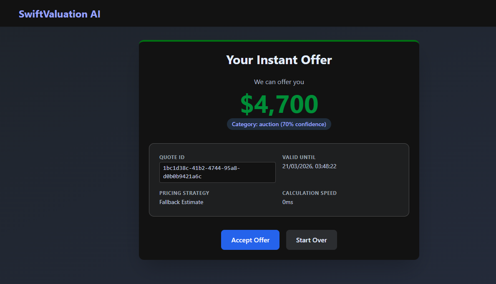

# SwiftValuation AI

Full-stack AI-assisted vehicle appraisal and instant offer platform built for modern auto-buying workflows.



## Executive Summary

SwiftValuation AI is a production style SaaS application that helps vehicle buying teams turn raw appraisal input into a structured, decision ready cash offer.

Instead of relying on disconnected spreadsheets, manual partner matching, and inconsistent quoting rules, the platform brings the full flow into a single system:

- capture the vehicle and condition details
- enrich the appraisal with VIN lookup and AI-assisted classification
- evaluate partner pricing logic
- generate a time-bound offer
- keep the workflow ready for CRM and media integrations

The result is a cleaner, faster, and more scalable quoting experience for high-volume car acquisition operations.

## Product Goals

This project was designed to feel credible as both:

- a client ready software demo
- a serious portfolio project with real architectural thought behind it

The implementation focuses on practical product concerns:

- structured appraisal intake
- deterministic pricing logic with extensibility
- safe fallback behavior when external services are unavailable
- clean backend separation between API, domain logic, and integrations
- a frontend flow that feels like an actual operations tool, not just a form

## What The Platform Does

### Appraisal Intake

The frontend walks a user through a multi step appraisal process covering:

- vehicle details
- VIN lookup
- title and drivability
- mechanical issues
- interior and exterior damage mapping
- pickup location

### AI-Assisted Classification

The backend uses `GROQ_API_KEY` based Groq integration to classify vehicles into operational categories such as `junk` or `auction`.

To keep the system reliable, classification is not dependency-fragile:

- Groq is used when configured
- rules-based fallback logic keeps quotes working when AI is unavailable
- mock mode supports local demos and development environments

### Partner-Aware Pricing

The valuation engine evaluates active partner records and pricing rules to produce the best available offer path. Current pricing patterns include:

- flat rate pricing
- vehicle specific pricing
- category based pricing
- zip and weight influenced pricing

### Media and Workflow Readiness

The platform also includes the foundation for downstream workflow features:

- presigned S3 uploads for vehicle media
- CRM publishing support through Zoho integration
- health checks, rate limiting, and centralized error handling

## Why This Project Is Strong

This is more than a CRUD app with an LLM bolted on.

The codebase demonstrates:

- clear separation of concerns
- practical domain modeling
- external integration boundaries
- resilient fallback logic
- test coverage around business critical backend flows
- a frontend designed around user workflow instead of component demos

## Architecture

## Backend

The backend is built with FastAPI and organized into focused layers:

- `app/main.py`
: application bootstrap, middleware wiring, router registration, health check

- `app/routers`
: HTTP endpoints for quotes, vehicles, partners, and photos

- `app/services`
: domain and integration logic such as valuation, Groq assessment, VIN decoding, S3 handling, and CRM publishing

- `app/models`
: SQLAlchemy entities for quotes, vehicles, partners, pricing rules, and uploaded media

- `app/schemas`
: request and response validation using Pydantic v2

- `app/tests`
: backend regression coverage for API and service behavior

Core backend services:

- `ValuationLogic`
: computes pricing outcomes and partner selection

- `SmartAssessor`
: performs Groq assisted classification with rules fallback

- `AutoSpecFetcher`
: resolves VIN based vehicle metadata

- `S3Service`
: generates upload URLs and S3 object references

- `CRMIntegration`
: publishes accepted quote data into Zoho compatible workflows

## Frontend

The frontend is a React + Vite TypeScript application centered on a guided wizard experience.

Main frontend areas:

- `components/QuoteForm`
: multi step appraisal flow

- `components/common`
: reusable UI primitives

- `hooks/useQuote`
: quote submission and response lifecycle

- `schemas/quote.ts`
: client side validation with Zod

- `utils/api.ts`
: API client helpers for backend communication

## Tech Stack

### Backend

- Python 3.11+
- FastAPI
- SQLAlchemy
- PostgreSQL
- Redis
- Pydantic v2
- Groq
- boto3
- pytest

### Frontend

- React 18
- TypeScript
- Vite
- Tailwind CSS
- React Hook Form
- Zod
- Vitest
- Playwright

## Repository Layout

```text
SwiftValuation-AI/
|-- backend/
|   |-- app/
|   |   |-- middleware/
|   |   |-- models/
|   |   |-- routers/
|   |   |-- schemas/
|   |   |-- services/
|   |   `-- tests/
|   |-- requirements.txt
|   `-- .env.example
|-- frontend/
|   |-- src/
|   |   |-- components/
|   |   |-- hooks/
|   |   |-- schemas/
|   |   |-- types/
|   |   `-- utils/
|   `-- package.json
`-- docs/
```

## Environment Configuration

Start from [`backend/.env.example`](./backend/.env.example).

Most important variables:

- `DATABASE_URL`
- `REDIS_URL`
- `GROQ_API_KEY`
- `GROQ_MODEL`
- `GROQ_VISION_MODEL`
- `AWS_ACCESS_KEY_ID`
- `AWS_SECRET_ACCESS_KEY`
- `S3_BUCKET_NAME`
- `ZOHO_CLIENT_ID`
- `ZOHO_CLIENT_SECRET`
- `ZOHO_REFRESH_TOKEN`
- `MOCK_MODE`
- `ZOHO_MOCK_MODE`

### Recommended Local Demo Settings

For a local demo friendly setup:

- set `MOCK_MODE=true`
- set `ZOHO_MOCK_MODE=true`
- provide `GROQ_API_KEY` if you want live AI classification

## Getting Started

## Backend Setup

```bash
cd backend
py -3.11 -m venv .venv
.\.venv\Scripts\activate
pip install --upgrade pip
pip install -r requirements.txt
python -m uvicorn app.main:app --reload --host 0.0.0.0 --port 8000
```

Run backend tests:

```bash
python -m pytest app/tests
```

## Frontend Setup

```bash
cd frontend
npm install
npm run dev
```

Useful frontend commands:

```bash
npm run test
npm run build
```

## Local Run Flow

1. Start PostgreSQL and Redis.
2. Start the backend from `/backend`.
3. Start the frontend from `/frontend`.
4. Open `http://localhost:3000`.
5. Complete the wizard and request a quote.

## API Reference

Main routes:

- `GET /health`
- `POST /api/v1/quotes/calculate`
- `GET /api/v1/vehicles/lookup`
- `GET /api/v1/vehicles/makes`
- `GET /api/v1/vehicles/models`
- `GET /api/v1/partners/`
- `POST /api/v1/photos/upload-url`
- `POST /api/v1/photos/confirm-upload`

Interactive docs:

- Swagger UI: `http://localhost:8000/docs`
- ReDoc: `http://localhost:8000/redoc`


## Verification Status

Current repository verification:

- backend tests passing
- frontend type-check passing
- frontend unit test passing
- frontend production build passing
- frontend `npm audit` clean

## Recent Improvements

Recent cleanup and hardening work includes:

- standardized on `GROQ_API_KEY` for AI configuration
- removed stale Claude based documentation references
- replaced hardcoded year logic with current year calculations
- improved graceful fallback behavior for VIN lookup and S3 flows
- polished the frontend offer and lookup experience
- upgraded frontend dependencies to remove known audit issues
- added backend tests for the new fallback and integration safe behavior

## Roadmap

- introduce authentication and role aware partner workflows
- replace automatic schema creation with managed migrations
- expand valuation logic into richer category and comp based pricing
- wire media uploads into full photo audit processing
- add async background jobs for CRM and enrichment flows
- deepen end to end test coverage across the quote journey

## Use Cases

SwiftValuation AI is a good fit as:

- a SaaS starter for auto acquisition teams
- a portfolio grade full stack system design project
- a demo app for AI assisted operational workflows
- a base platform for partner marketplace or dealer network features